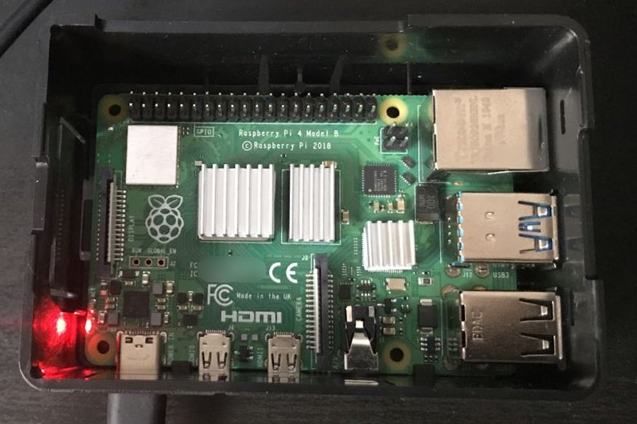

This Gist is dedicated to explain the network config process of a Raspberry Pi4  

# Ubuntu 20.04.1 LTS server config sur Raspberry Pi 4 model B


| Sources | Liens |
| --  | --  |
| cloudinit readthedocs |[https://cloudinit.readthedocs.io/](https://cloudinit.readthedocs.io/)|
| Netplan |[https://netplan.io/reference](https://netplan.io/reference)|
| Ubuntu | [https://doc.ubuntu-fr.org/](https://doc.ubuntu-fr.org/)|
| free Code Camp | [https://www.freecodecamp.org/news/build-a-personal-dev-server-on-a-5-dollar-raspberry-pi/](https://www.freecodecamp.org/news/build-a-personal-dev-server-on-a-5-dollar-raspberry-pi/)|
| cyberciti | [https://www.cyberciti.biz/faq/howto-change-ssh-port-on-linux-or-unix-server/](https://www.cyberciti.biz/faq/howto-change-ssh-port-on-linux-or-unix-server/) |
| VS Code | [https://code.visualstudio.com/](https://code.visualstudio.com/)| 

### Attention le serveur est buggé à l'origine avec une config de clavier en qwerty par défaut
- Modifier la config clavier temporairement
 ``` $ sudo loadkeys fr ```
- ou définitevement
 ``` $ sudo dpkg-reconfigure keyboard-configuration ```
- Répondre à toutes questions demandées et reboot le serveur

### Config de la connection wifi

#### step 1
- Pour ma version de serveur (Ubuntu 20.04.1) substituer les écritures de:
 ``` eth0 ``` par ``` wlan0 ``` pour le nom de l'interface sans fil
 ``` ls  /sys/class/net ```

#### step 2
- Accéder au dossier ```etc/netplan``` on a deux fichiers potentiels :
soit ``` 01-network-manager-all.yaml ```
soit ``` 50-cloud-init.yaml ```
Pour moi c'est ``` 50-cloud-init.yaml ```

#### step 3
- Editer le fichier netplan .yaml
  ``` $ sudoedit /etc/netplan/50-cloud-init.yaml ``` 


- On passe de ca :
  ``` yaml
  network:
      ethernets:
          eth0:
              dhcp4: true
              optional: true
      version: 2
  ```
- A ca ( [possibilité de passer avec une IP fixe](#IPFixe) ) ce que je n'ai personnellement pas fait:
  ```yaml
  network:
      ethernets:
          eth0:
              dhcp4: true
              optional: true
      version: 2
      wifis:
          wlan0:
              optional: true
              access-points:
                  "nomDeVotreServeur":
                      password: "VotreMotDePasse"
              dhcp4: true
  ```

- Attention à l'indentation car en .yaml celà provoque une erreur de syntaxe.

- Ce fichier est généré à partir des informations fournies par la source de données. Les modifications ne persisteront pas lors d’un redémarrage d’instance.  Pour désactiver les capacités de configuration réseau de cloud-init, écrivez un fichier :
 ``` /etc/cloud/cloud.cfg.d/99-disable-network-config.cfg ```

- avec la commande suivante à l'intérieur de ce dernier :
 ``` network: {config: disabled} ```

#### step 4

- Appliquer les changements :
 ``` $ sudo netplan try ```
 ``` $ sudo netplan apply ```
  - si problème :
 ``` $ sudo netplan --debug apply ```

- On teste la connexion internet en ping sur google (ou ailleurs)
 ``` $ ping 8.8.8.8 ```
- Si ok on redémarre
 ``` $ sudo reboot ```


#### step 5 
- Mises à jour
 ``` $ sudo apt update ```
 ``` $ sudo apt upgrade ```
 ``` $ sudo reboot ```

#### On re-teste la connectivité
``` $ ping 8.8.8.8 ```


#### on installe les "options" (Pour ma part ayant opté pour des dissipateurs thermiques j'ai choisit à minima de pouvoir checker la température du procésseur ainsi que du chipset wifi)
- Surveillance de la température avec sensors
  ``` ubuntu@ubuntu:/$ sudo apt install lm-sensors ```
- Check température
  ```ssh
  $ sensors
  cpu_thermal-virtual-0
  Adapter: Virtual device
  temp1:        +83.3°C 
  ```

<hr>
<h3 align="center">Rappels</h3>
<hr>

#### Pour répertorier tous les packages dans la base de données de packages du système, y compris tous les packages, installés et désinstallés, 
``` $ dpkg -l ```
- Génère une très longue liste et sa gestion par une interface graphique est possible mais non abordée ici.

#### Se connecter en tant que super utilisateur (par défaut le root utilisateur n'a pas de mot de passe donc vous devrez le définir)
```ssh
$ su -
password 
root@ubuntu:~/.ssh#
```

#### Accès SSH serveur personnel UBUNTU 20.04.1

##### Step 1 Génération de clé sur machine locale "à côté de celle(s) existante(s)
``` ssh-keygen -b 4096 -f ~/.ssh/id_rsa_serveur_maison -N "" ```

|Clair| option | valeur |
| -- | -- | -- |
| niveau de cryptage de la clé | -b | 4096 |
| pass phrase vide | -N | "" |
| nommage de la clé || id_rsa_serveur_maison  |

- Placer la cle publique sur le serveur dans le fichier ``` .ssh/authorized_keys ```

##### Step 2 Sur le serveur Ubuntu après sa mise à jour ``` openssh ``` est installé à défaut saisir :

``` $ sudo apt install openssh-server ```

##### Step 3 Vérifier que le status du service sshd est actif (status: Incative === aucun accès ssh possible): 
``` $ systemctl sshd status ```
``` status: Inactive ```
Commandes pour le ssh server daemon :
 ``` $ sudo systemctl start ssh ```
 ``` $ sudo systemctl restart ssh ```
 ``` $ sudo systemctl stop ssh ```

##### Step 4 Ouvrir le port 22 pour autoriser le trafic entrant sur le serveur :

``` $ sudo ufw allow ssh ```
- Par sécurité il convient de changer (optionnel) le port alloué par défaut en le choisisant avec un numéro supérieur à 1024
Les numéros de port 0-1023 sont réservés pour divers services système. Par conséquent, il est recommandé de choisir des numéros de port compris entre 1024 et 65535 ( [Liste commune de services privilégiés et désignés comme des ports bien connus](https://www.cyberciti.biz/faq/howto-change-ssh-port-on-linux-or-unix-server/) ).

  ```$ sudoedit /etc/ssh/sshd_config ```

- Par exemple ``` Port 8282 ``` 
- Une fois la modification effectuée ouvrir ce dernier
 ```$ sudo ufw allow 8282/tcp ``` 
- Il y a une possibilité d'autoriser la connection sur un port serveur en provenance uniquement d'une IP spécifique avec cette syntaxe :
 ```$ sudo ufw allow from {IP-SUB/net} to any port 8282 ```
 ou
 ``` $ sudo ufw allow from {IP-SUB/net} to any port 8282 proto tcp ```
- On vérifie les réglages 
 ``` $ sudo ufw status ```
- Pour appliquer les changements redémarrer le service ssh 
 ``` $ sudo systemctl restart ssh ```
- Pour se connecter à distance à un numéro de port spécifique du serveur SSH, utilisez l’option -p ssh :
 ``` $ ssh -p 8282 ubuntu@10.0.0.137 ```

##### Step 5 Activer le démarrage automatique  du service ssh : 
```$ sudo systemctl enable ssh ```

##### Step 6 Obtenir son IP de serveur :
``` $ ip a ```

##### Step 7 Ajout de l'hote de connection depuis son éditeur de texte ici VS Code :
- J'ai utilisé l'extension [Remote-ssh](https://code.visualstudio.com/blogs/2019/07/25/remote-ssh) déjà expérimentée lors d'un projet
Dans mon éditeur de texte en bas à guauche je clique sur la petit carré vert et je suis la procédure décrite dans la doc officielle
Remote-SSH: Connect to host
  ``` ubuntu@10.0.0.137 -i ~/.ssh/id_rsa_serveur_maison ```
On sélectionne le dossier où la clé ssh dévolue est stockée et boom !

<hr>

#### <a id="IPFixe">  Option on voit comment configurer une adresse IP statique sur Ubuntu Server 20.04 LTS.</a>
- Lister les détails de la config réseau de son serveur Ubuntu
  ``` $ ip a ```

- Sur la sortie 2 avec le nom de l'interface réseau ens33 et adresse IP 192.168.20.149 pour l'exemple moi eth0 et pas d'adresse IP 

##### S'assurer que l'interface réseau n'est pas gérée par CloudInit.
- Pour cela, ouvrez le fichier de configuration ``` /etc/cloud/cloud.cfg.d/subiquity-disable-cloudinit-networking.cfg ``` avec la commande suivante:
 ``` $ sudo nano /etc/cloud/cloud.cfg.d/subiquity-disable-cloudinit-networking.cfg  ```
- Mettre la consigne:
 ```network: {config: disabled} ```
##### Dans le cas où ce fichier n'existe pas le créer : 
 ```/etc/netplan/00-installer-config.yaml```
- Editer le fichier avec la commande : 
 ``` $ sudo nano /etc/netplan/00-installer-config.yaml ```

- A l'origine :
  ```yaml
  ### This is the network config written by 'subiquity'
  networks:
      ethernets:
          eth0:
              dhcp4: true
      version: 2
  ```
- Pour assigner une IP statique tout effacer et mettre les données comme ci-dessous :
  ```yaml
  version: 2
  ethernets:
      eth0:
          addresses: [10.100.30.178]                        #adresse IPv4 (adresse IP de votre serveur en sous réseau)
          gateway4: 132.124.34.176                      #default route soit adresse IP publique de votre box
          nameservers:
              addresses: [25.344.122.19, 26.350.124.22] #adresses DNS de votre box
  ```

- Attention à l'indentation car les fichier YAML plante si mauvaise indentation

- On teste avec la commande 
 ```$ netplan try ```

- Si ok message demandant de confirmer par 
 ``` press ENTER before the timeout to accept the new configuration ```
- On tape la commande
 ``` $ sudo netplan apply ```
- On redémarre
 ``` $ sudo reboot ```

 <hr>

### Cas particulier de la migration d'un pc de Ubuntu 18.04 LTS vers 20.04 LTS et d'une carte PCIE wifi (propriétaire)

- Après la mise à jour effectuée via: 
  ```ssh
  $ sudo apt-get update
  $ sudo apt-get upgrade
  ````
- Vérifier si la carte réseau est reconnue
  ```ssh
  $ lspci
  ````
- La sortie devrait être similaire à celle-ci :
  ```ssh
  08:00.0 Network controller: Broadcom Corporation BCM4352 802.11ac Wireless Network Adapter (rev 03)
  ```
- Auxquel-cas effectuer la procédure suivante :
  ```ssh
  $ sudo apt-get update
  $ sudo apt-get --reinstall install bcmwl-kernel-source
  ```
- Il faut installer le pilote qui doit être propriétaire (attention à bien vérifier la version du chipset de la carte réseaux):
  ```ssh
  sudo ubuntu-drivers install [driver[:version][,driver[:version]]]
  ```
- Il faudra suivre la procédure de validation secure boot avec la saisie d'un mot de passe afin de pouvoir valider cette instllation de pilote propriétaire.

- Redémarrer la machine :
```ssh
$ sudo reboot
```
Enjoy !!!
